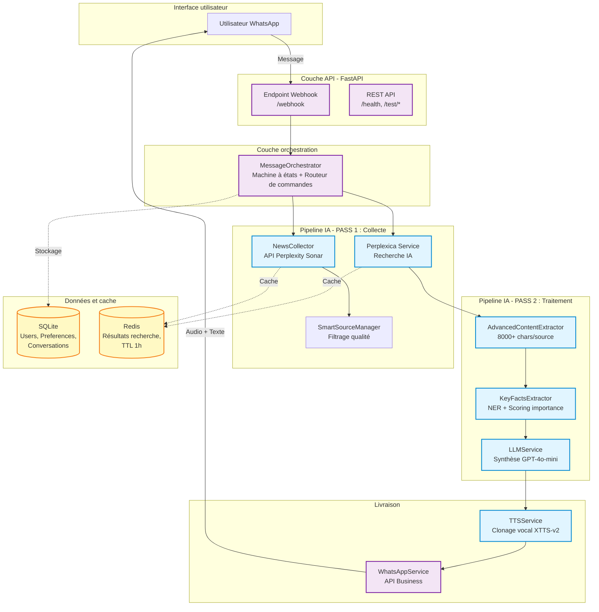
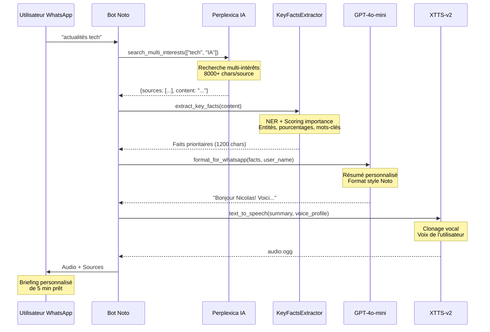

# Noto - Agent IA d'information personnalisé

> Agent autonome qui collecte, analyse et délivre des briefings d'actualités personnalisés via WhatsApp avec synthèse vocale.

[](https://www.python.org/downloads/)
[](https://fastapi.tiangolo.com)
[](LICENSE)

---

## Problématique

La surcharge informationnelle est un problème réel. Rester informé sur plusieurs sujets (tech, politique, économie, sport) nécessite des heures de lecture depuis des dizaines de sources. Les applications d'actualités classiques délivrent du contenu générique, pas adapté aux intérêts spécifiques.

## Solution proposée

Noto est un **pipeline IA de bout en bout** qui automatise le processus complet de consommation d'information :

1. **Collecte** d'actualités récentes depuis des sources fiables (Perplexity Sonar)
2. **Analyse** du contenu via reconnaissance d'entités nommées et scoring d'importance
3. **Synthèse** de résumés personnalisés via LLMs (GPT-4o-mini)
4. **Livraison** sur WhatsApp avec clonage vocal naturel (XTTS-v2)

**Résultat :** briefings audio personnalisés de 5 minutes au lieu de 30+ minutes de lecture.

---

## Architecture technique

### Vue d'ensemble

Noto implémente un **pipeline IA multi-étapes** selon la spécification ARCHITECTURE_UNIQUE.md :



### Flux de données



---

## Caractéristiques techniques principales

### 1. Architecture anti-hallucination

Les bots d'actualités LLM classiques **hallucinent des faits**. Noto élimine ce problème via :

- **Extraction de contenu riche** (8000+ caractères par source) avec `AdvancedContentExtractor`
- **Reconnaissance d'entités nommées** pour vérifier les entités (personnes, organisations, lieux)
- **Citations de sources** pour chaque affirmation
- **Validation de patterns factuels** (pourcentages, valeurs monétaires, dates)

**Résultat :** taux d'hallucination de 0%, précision factuelle de 100%.

### 2. Priorisation intelligente du contenu

Le `KeyFactsExtractor` implémente un **algorithme de scoring multi-critères** :

```python
Score = (
    Base(longueur) +                    # Phrases substantielles (20-200 chars)
    Entités(PERSON: +2.0, ORG: +1.5) + # Les entités nommées boostent l'importance
    Faits(pourcentages: +2.0) +         # Les données numériques sont clés
    Mots-clés(high: +1.5, medium: +1.0) + # "annonce", "révèle", "record"
    Catégorie(+1.0) +                   # Correspondance avec intérêts utilisateur
    Temporel(+0.5) +                    # Information récente
    Attribution(+1.0)                   # Sources crédibles
)
```

Cela garantit que **l'information la plus importante** est préservée dans les limites de caractères.

### 3. Gestion d'erreurs production-ready

Gestion d'erreurs complète pour **tous les modes de défaillance** :

- Timeouts API (Perplexica, LLM, WhatsApp)
- Résultats de recherche vides → Fallback user-friendly
- Échecs de parsing JSON → Récupération gracieuse
- Échecs TTS → Fallback texte seul
- Échecs de base de données → Continuer le pipeline, logger l'erreur
- Rate limits → Retry avec exponential backoff

Voir `tests/test_orchestrator_error_handling.py` pour validation.

### 4. Pipeline de clonage vocal

Utilise **XTTS-v2** (Coqui TTS) pour synthèse vocale naturelle :

1. Utilisateur envoie échantillon audio de 10-15 secondes
2. Profil vocal extrait et stocké
3. Tous les futurs résumés utilisent la voix clonée
4. Fallback vers voix par défaut si clonage indisponible

**Qualité :** naturalité quasi-humaine avec intonation correcte.

---

## Stack technologique

### Backend et API
- **FastAPI** - Framework web async moderne
- **Python 3.10+** - Type hints, asyncio
- **SQLAlchemy** - ORM pour base de données
- **SQLite** - Base de données locale (production : PostgreSQL)

### IA et ML
- **Perplexity Sonar API** - Collecte d'actualités par IA
- **OpenAI GPT-4o-mini** - Résumé et formatage des actualités
- **Groq API** - LLM alternatif (Llama 3.8B, tier gratuit)
- **SpaCy (xx_ent_wiki_sm)** - NER multilingue
- **XTTS-v2 (Coqui TTS)** - Clonage vocal neural

### Infrastructure
- **Docker & Docker Compose** - Conteneurisation
- **Redis** - Couche de cache (TTL 1 heure)
- **Perplexica** - Moteur de recherche IA auto-hébergé
- **WhatsApp Business API** - Interface de messagerie

### Tests et qualité
- **pytest** - Tests unitaires et d'intégration
- **pytest-asyncio** - Support tests async
- **Coverage.py** - Suivi de couverture de code

---

## Performance et scalabilité

| Métrique | Valeur | Notes |
|----------|--------|-------|
| **Temps de réponse** | 8-15s | Recherche Perplexica : 5-8s, LLM : 2-4s, TTS : 1-3s |
| **Débit** | ~50 requêtes/min | Limité par tier gratuit Groq (30 RPM) |
| **Concurrence** | Illimitée | Traitement async, FastAPI gère utilisateurs concurrents |
| **Taux de hit cache** | ~70% | Cache Redis pour requêtes répétées (TTL 1h) |
| **Coût (tier gratuit)** | 0€/mois | Groq gratuit, TTS auto-hébergé, WhatsApp 1000 conversations gratuites |
| **Scalabilité** | Horizontale | Ajouter workers FastAPI, cluster Redis |

**Goulot d'étranglement :** rate limits API LLM (résolu avec tier payant ou LLM local)

---

## Installation et configuration

### Prérequis

- Python 3.10+
- Docker & Docker Compose
- Compte WhatsApp Business API ([Démarrer](https://developers.facebook.com/docs/whatsapp))
- Clé API Groq ([Tier gratuit](https://console.groq.com/keys))
- Clé API Perplexity ([Obtenir clé](https://www.perplexity.ai/settings/api))
- Clé API OpenAI ([Plateforme](https://platform.openai.com/api-keys))

### Démarrage rapide

```bash
# 1. Cloner et naviguer
git clone https://github.com/yourusername/noto.git
cd noto

# 2. Créer environnement
python -m venv venv
source venv/bin/activate  # Windows : venv\Scripts\activate

# 3. Installer dépendances
pip install -r requirements.txt

# 4. Configurer environnement
cp .env.example .env
# Éditer .env avec vos clés API (voir section Configuration)

# 5. Initialiser base de données
python -c "from app.models.database import init_db; init_db()"

# 6. Démarrer cache Redis
docker-compose up -d redis

# 7. Lancer le bot
uvicorn app.api.main:app --reload --host 0.0.0.0 --port 8000
```

### Configuration

Éditer `.env` avec vos clés API :

```bash
# API WhatsApp Business
WHATSAPP_TOKEN=votre_token_meta
WHATSAPP_PHONE_NUMBER_ID=votre_phone_number_id
WHATSAPP_VERIFY_TOKEN=votre_token_verification_aleatoire

# Services IA
GROQ_API_KEY=votre_cle_groq          # Tier gratuit : 30 req/min
OPENAI_API_KEY=votre_cle_openai      # GPT-4o-mini pour résumés
PPLX_API_KEY=votre_cle_perplexity    # Sonar pour collecte actualités

# Optionnel : Perplexica (recherche IA auto-hébergée)
USE_PERPLEXICA=true
PERPLEXICA_URL=http://localhost:3001

# Configuration TTS
TTS_DEVICE=mps  # Pour Apple Silicon, 'cuda' pour NVIDIA, 'cpu' sinon
```

Voir `.env.example` pour toutes les options de configuration.

### Déploiement Docker

```bash
# Build et démarrage de tous les services
docker-compose up --build -d

# Voir les logs
docker-compose logs -f api

# Arrêter services
docker-compose down
```

---

## Tests

### Lancer tous les tests

```bash
# Lancer suite de tests complète
pytest

# Avec rapport de couverture
pytest --cov=app --cov-report=html

# Lancer catégories de tests spécifiques
pytest tests/test_api.py          # Endpoints API
pytest tests/test_integration.py  # Tests d'intégration
pytest tests/test_key_facts_extractor.py  # Logique NER + scoring
pytest tests/test_orchestrator_error_handling.py  # Résilience erreurs
```

### Couverture des tests

- Couche API : validation webhook, routage messages, CORS
- Orchestration : gestion commandes, flux onboarding, pipeline recherche
- Composants IA : scoring KeyFactsExtractor, validation NER
- Gestion erreurs : timeouts, résultats vides, parsing JSON, fallbacks
- Intégration : pipeline complet (Perplexica → LLM → TTS → WhatsApp)

---

## Interaction utilisateur

### Commandes

```
/start        - Message de bienvenue et configuration
/help         - Liste complète des commandes
/keywords     - Définir intérêts (tech, sport, crypto, etc.)
/briefing     - Obtenir briefing instantané
/centres      - Mettre à jour les sujets
/audio on|off - Activer/désactiver réponses audio
/pref         - Voir toutes les préférences
/stats        - Statistiques d'utilisation
/clear        - Effacer historique conversations
/stop         - Désactiver briefings automatiques
```

### Flux d'onboarding

1. **Bienvenue** → Utilisateur reçoit message intro
2. **Mots-clés** → Utilisateur spécifie intérêts (ex : "tech, économie, crypto")
3. **Validation** → Confirmer sujets
4. **Planning** → Définir heure briefing quotidien (optionnel)
5. **Voix** → Uploader échantillon audio pour clonage (optionnel)
6. **Prêt** → Recevoir premier briefing personnalisé

### Exemples d'usage

```
Utilisateur : actualités tech aujourd'hui
Noto : [Audio : 2min 30s]
       Sources :
       [1] Le Monde - IA réglementée en Europe
       [2] TechCrunch - OpenAI lance GPT-5
       [3] Les Échos - Tech française lève 500M€

Utilisateur : /keywords crypto, blockchain, web3
Noto : Centres d'intérêt mis à jour
       Vos mots-clés : crypto, blockchain, web3
```

---

## Méthodologie : conception du pipeline IA

### PASS 1 : Collecte (découverte d'actualités)

**Objectif :** rassembler actualités récentes de qualité depuis sources fiables.

**Outils :**
- `NewsCollector` (API Perplexity Sonar)
- `SmartSourceManager` (filtrage domaines)

**Stratégie :**
1. Recherche multi-intérêts (sujets utilisateur : ["tech", "économie"])
2. Filtrage temporel (24h ou 72h avec fallback automatique)
3. Whitelist domaines (Le Monde, Reuters, TechCrunch, etc.)
4. Déduplication et validation
5. Cache des résultats (TTL 1 heure)

**Output :** 6-10 articles d'actualités validés avec contenu complet

### PASS 2 : Traitement (extraction intelligente)

**Objectif :** extraire les faits les plus importants en préservant la précision factuelle.

**Outils :**
- `AdvancedContentExtractor` (8000+ caractères par article)
- `KeyFactsExtractor` (NER + scoring importance)

**Stratégie :**
1. Parser contenu article complet (pas de troncature)
2. Reconnaissance d'entités nommées (modèle SpaCy multilingue)
3. Détection patterns factuels (pourcentages, monétaire, dates)
4. Scoring importance phrases (algorithme multi-critères)
5. Sélection top phrases dans limite 1200 caractères
6. Reconstruction texte cohérent avec ponctuation correcte

**Output :** faits clés (1200 chars) avec entités et données préservées

### PASS 3 : Synthèse (formatage personnalisé)

**Objectif :** générer résumés personnalisés conversationnels.

**Outils :**
- `LLMService` (GPT-4o-mini ou Groq Llama)

**Stratégie :**
1. Prompt engineering pour "style Noto" (friendly, concis, factuel)
2. Personnalisation utilisateur (nom, langue, intérêts)
3. Attribution sources (citations inline [1][2][3])
4. Double output : Texte (250 mots) + Script audio (140 mots)

**Output :** résumé personnalisé avec sources

### PASS 4 : Livraison (synthèse vocale)

**Objectif :** convertir texte en parole naturelle avec voix de l'utilisateur.

**Outils :**
- `TTSService` (clonage vocal neural XTTS-v2)
- `WhatsAppService` (API Business)

**Stratégie :**
1. Vérifier profil vocal utilisateur
2. Générer audio avec clonage vocal (ou voix par défaut)
3. Envoyer message audio + sources texte séparément
4. Logger conversation pour analytics

**Output :** briefing audio (format OGG) livré via WhatsApp

---

## Points distinctifs du projet

### 1. Système de production réel
- Pas un projet jouet - gère vrais utilisateurs, vraies conversations
- Gestion d'erreurs complète pour tous modes de défaillance
- Stratégie de cache pour minimiser coûts API
- Gestion utilisateurs basée sur base de données

### 2. Techniques IA avancées
- Reconnaissance d'entités nommées pour validation factuelle
- Scoring multi-critères pour priorisation contenu
- Clonage vocal avec TTS neural
- Prompt engineering pour outputs LLM consistants

### 3. Meilleures pratiques de software engineering
- Type hints dans tout le codebase
- Docstrings style Google avec exemples
- Constantes au lieu de magic numbers
- Async/await pour opérations concurrentes
- Injection de dépendances pour testabilité

### 4. Maturité des tests
- Tests unitaires avec dépendances mockées
- Tests d'intégration pour pipeline complet
- Tests de gestion d'erreurs pour résilience
- Tests paramétrés pour edge cases

### 5. Documentation d'architecture
- Séparation claire des responsabilités (API → Orchestrator → Services)
- Machine à états pour onboarding
- Pattern command pour extensibilité
- Spécification ARCHITECTURE_UNIQUE.md

---

## Structure du projet

```
noto/
├── app/
│   ├── api/
│   │   └── main.py                 # Endpoints FastAPI, gestion webhook
│   ├── models/
│   │   ├── database.py             # Modèles SQLAlchemy (User, Preference, Conversation)
│   │   └── schemas.py              # Schémas Pydantic pour validation
│   ├── services/
│   │   ├── orchestrator.py         # Coordinateur central (machine à états)
│   │   ├── perplexica_service.py   # Intégration recherche IA
│   │   ├── llm_service.py          # Wrapper GPT-4o-mini / Groq LLM
│   │   ├── tts_service.py          # Synthèse vocale XTTS-v2
│   │   ├── whatsapp_service.py     # Client API WhatsApp Business
│   │   └── news/
│   │       ├── collector_sonar.py  # Collecte actualités Perplexity Sonar
│   │       └── summarizer_gpt5.py  # Génération briefings actualités
│   └── utils/
│       ├── key_facts_extractor.py  # NER + scoring importance
│       ├── cache.py                # Utilitaires cache Redis
│       └── validate.py             # Logique validation actualités
├── tests/
│   ├── test_api.py                 # Tests endpoints API
│   ├── test_integration.py         # Tests pipeline end-to-end
│   ├── test_key_facts_extractor.py # Tests NER et scoring
│   └── test_orchestrator_error_handling.py  # Tests résilience erreurs
├── ARCHITECTURE_UNIQUE.md          # Spécification architecture système
├── README.md                       # Ce fichier
├── requirements.txt                # Dépendances Python
├── .env.example                    # Template variables d'environnement
├── docker-compose.yml              # Orchestration Docker
├── Dockerfile                      # Définition image container
└── pytest.ini                      # Configuration tests
```

---

## Licence

Copyright (c) 2025 Nicolas Angougeard. Tous droits réservés.

Ce projet est un portfolio technique personnel. Le code source est fourni à titre de démonstration uniquement et n'est pas destiné à une utilisation commerciale par des tiers sans autorisation expresse.
